- [Linux](#linux)
  - [Command Line Interface (CLI) basics in Linux](#command-line-interface-cli-basics-in-linux)
    - [Basic bash syntax](#basic-bash-syntax)
    - [Variables in the CLI](#variables-in-the-cli)
    - [Quoting](#quoting)
    - [man pages](#man-pages)
    - [Info page](#info-page)
  - [Using Directories and Listing Files in Linux](#using-directories-and-listing-files-in-linux)
    - [Files and Directories](#files-and-directories)
      - [Basic topography of the filesystem in the linux](#basic-topography-of-the-filesystem-in-the-linux)
      - [Moving around directory](#moving-around-directory)
      - [Hidden Files and Directories](#hidden-files-and-directories)
      - [Home Directories](#home-directories)
      - [Absolute and Relative Paths](#absolute-and-relative-paths)
    - [Working with files](#working-with-files)
      - [Creating, Moving and Deleting files](#creating-moving-and-deleting-files)
      - [Case sensitivity](#case-sensitivity)
      - [Simple Globbing](#simple-globbing)
    - [Archiving files on the command line](#archiving-files-on-the-command-line)
      - [Archiving files and dir](#archiving-files-and-dir)


# Linux 
`
## Command Line Interface (CLI) basics in Linux

### Basic bash syntax 

> basic bash syntax is `ls` is a command followed by space and followed by options for that command

in the terminal if u see username and `#` sign it means you are root user logged in. If you see `$` sign you are unpreviledged user. 

any file starts with `.` is hidden file to see them `ls -a` 


l = long listing
s = size information 
h = human readable ( size `20000` will be shown as `20MB` )
a = all 


📕 `ls -lh` shortcut and best command show permission , file owner and date of creation

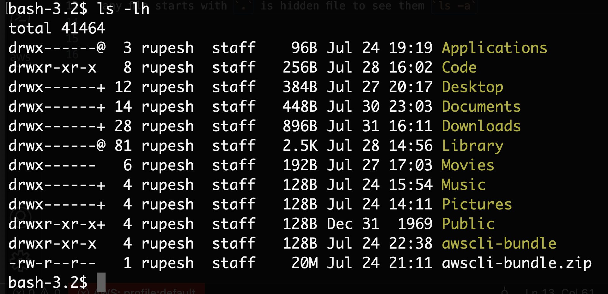


`ls` =  shows file on current directory 

`ls -l` = long listing some permission info

`ls -ls` = long listing some permission info and size info

`ls -alsh` = long listing some permission info, size info, human readable

`cat` = cancatinate out, displays the file text

### Variables in the CLI

Using variable store values to refer, don't need to be declared or datatype. There are default variables `$`, `$PS1`, `$PATH` etc. To refer a variable you have to use `$` sign 

`$HOME` = current user home directory
`$PS1`  = primary prompt string 
`$(ls)` = anything inside the parentehsis will execute before interpreting in JS we have `eval()` similarly. 

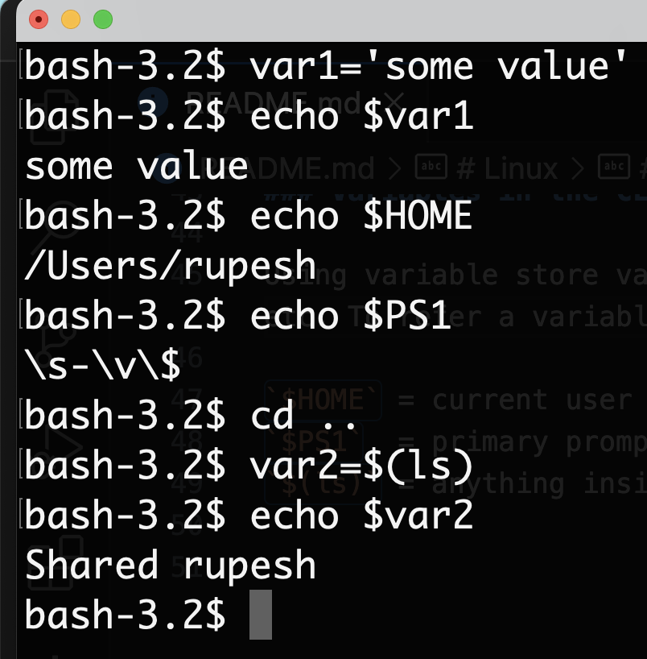


### Quoting 

`"` preserve literal value for most chars except `'` , `$`.  You acan use if you want to save some string with space. If you dont give quote it will parse the space as separation between 2 commands and execute each word as command. 

`\` can be used for single space

`'` it preserves the literal value, consider everything as string including `\`, `$` 


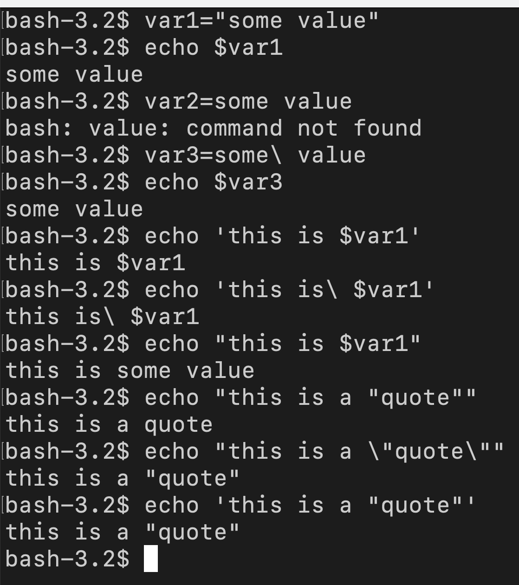


### man pages 

`man` is second nature for you to use it to learn more about cli commands if u work more on linux.

`man` (manual) pages are traditional pages of software documents for that package, man is Installed when u install a package. 

`man ls` man followed by command show `name`, `synopsis` (how to use command), `description` (detail of options to pass on command). Use up and down arrow to navigate. 

exit status `0` is okay, anything more than that is not okay.  You can print exit status by running `$?`

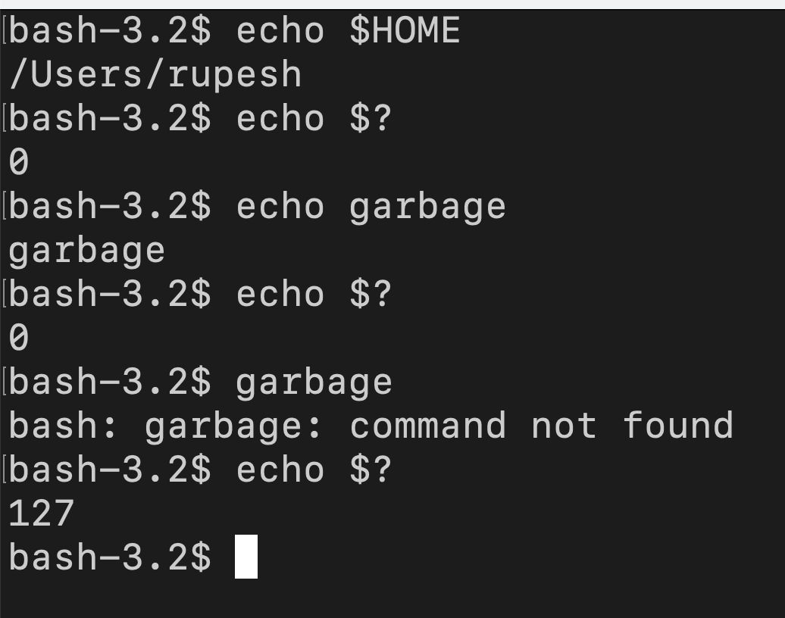

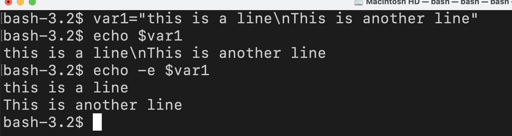


`man -k block` here `-k` will search all the commands that has block in the description. If you know what command does then search for the keywords find the command. 


### Info page

`info` followed by command gives additoinal document provides more detail info for a command compare to `man`. Use `/` to search anything in the details. It is like a page with chapter press `u` to go up `p` to go previous. If there is no info available it will pull the `man` page.

`htop` if u install to see all processses running then you can run `info htop` then since `htop` has no info installed you will see the `man` page. 

## Using Directories and Listing Files in Linux

### Files and Directories 

`FHS` Filesystem Hierarchy Standard defines structure of the filesystem in linux. 

We have hard drive in the host, when you install OS, it will put filesystem on hardrive and on the filesystem it will place file. Linux follow hierarchy starts with `/`. If you run `cd /` you are at the top of your filesystem nothing is above this directory. In windows this is like a `C:` c drive, we are at the drive level. 

#### Basic topography of the filesystem in the linux

- `/` = shows folders that are in the root of the filesystem: 
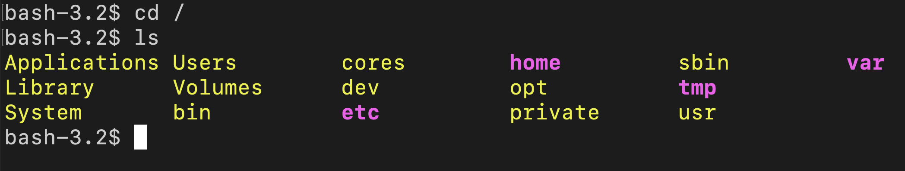
- `ls /bin` = in the `bin` folder you have commands that a current `user` can run
  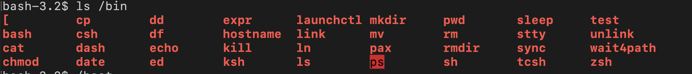
- `/boot`   = static boot files necesary to boot the linux kernal
- `/dev`    = device files could be block, terminal, sudo device files
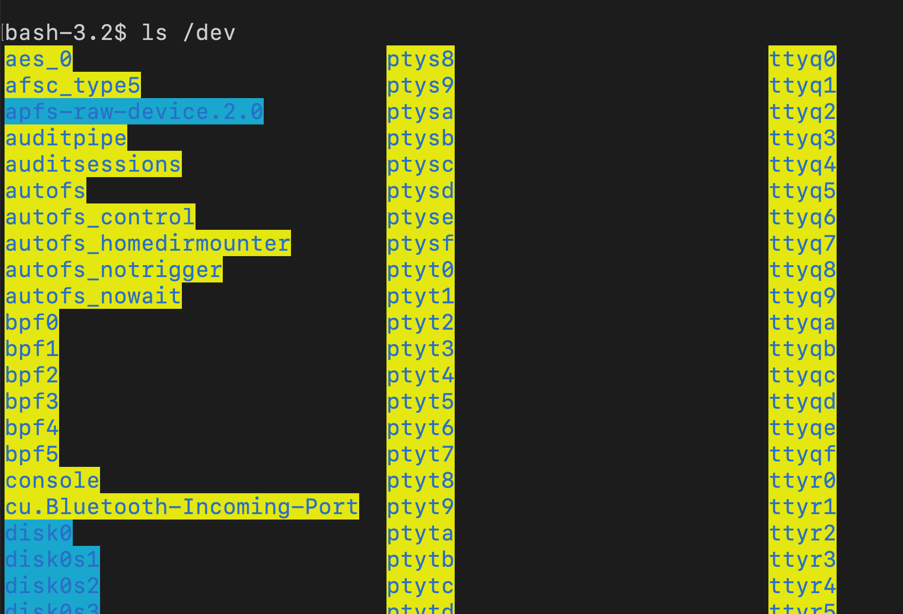
- `/etc`    = all config files are here, if u install apache server it's conf file will be in `/etc/http` folder
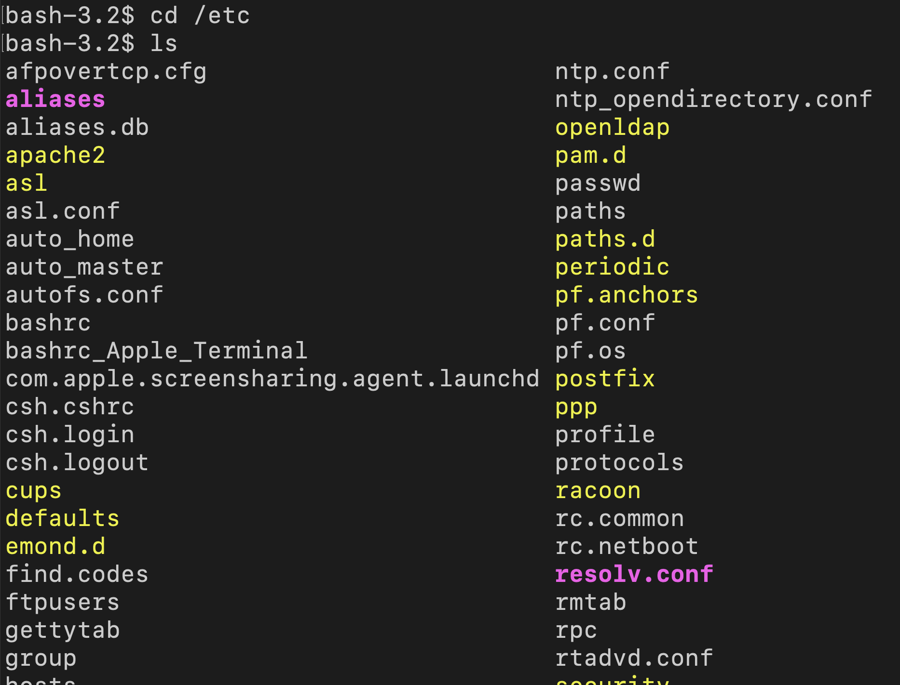
- `/home`   = all user's home dir
- `/lib`    = shared libraries 
- `/mnt`    = temp mount ( if u r mounting some other drive device like nfs u do here)
- `/opt`    = optional packages, like in mac you have `homebrew` inside `/opt` folder. 
- `/proc`   = kernal procesing files, `cat /proc/cpuinfo` to see cpu details of host
- `/root`   = root user's home dir
- `/run`    = applications state file
- `/sbin`   = system administrator's commands that a `root` user can only run for system adminstration type work
  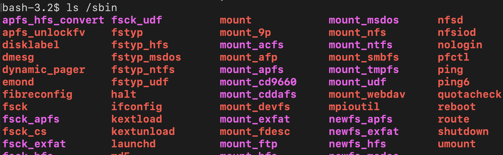
- `/srv`    = service data
- `/tmp`    = temporary directory, the files here are transient files are non persistent. When you reboot PC `/tmp` folder will become empty.
- `/usr`    = these are user binaries like /bin at the top 
- `/var`    = variable datafile 
 
``
#### Moving around directory 

- `pwd`                = working directory
- `cd`                 = change directory 
- `cd ~/` or `cd`      = go to current user's home directory 
- `cd -`               = go back to previous dir
- `cd .`               = move to current directory where you are now single `.` is the directory level you are in now. 
- `cd ..`              = move one level up from current dir. 
- `cd ../..`           = move 2 levels up from current dir.

#### Hidden Files and Directories

`touch .file` = creats a hidden file called `.file`. 


#### Home Directories

contains the users directory dedicated for the current user under `/home`. 

- `/etc/passwd` = contains all users in the Linux system. it has `name`, `userid`, `groupid`
- `env` = shows all environment variables, that are set when you login  
  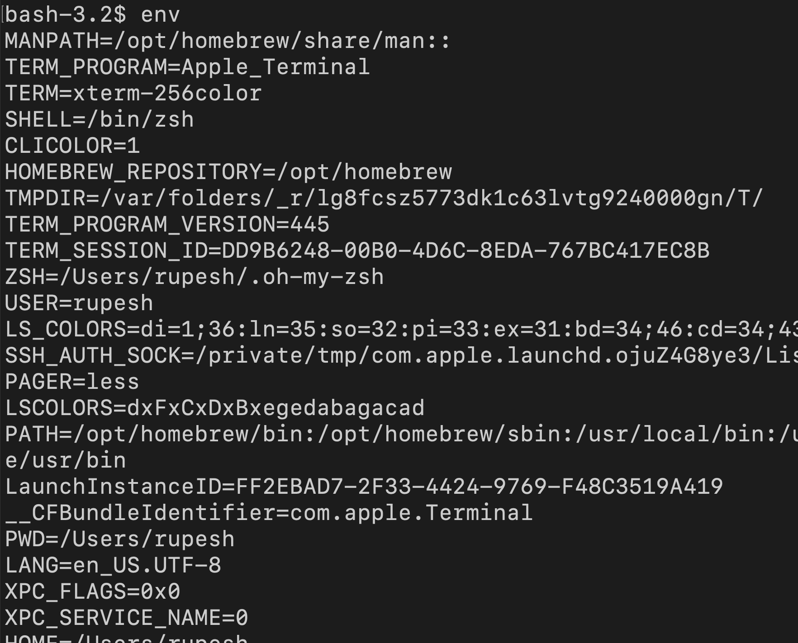


#### Absolute and Relative Paths

A path is unique location to a file or directory could be specifiy as absolute or relative path. Relative path depends on the current working dir location. In bash script normally you use absolute path to make sure it works where u put the script file.

`cat file1` = relative path to file since it will find the file in current dir
`cat /Users/rupesh/file1` = absolute file path always starts with `/`. Absolute path will be same regardless of your working dir 
`cat ../file1`  = relative path, go one level up and find `file1`. 


### Working with files

#### Creating, Moving and Deleting files

- `mkdir test`          = creates `test` folder
- `cp test test3 -r`    = copy `test` dir to `test3` reccursively. 
- `mv test /tmp/`       = move `test` in `/tmp/` dir
  

#### Case sensitivity

`touch file File` will create 2 files. 

#### Simple Globbing

Globbing is using partial matching to work with group of section of files or directories. To match pattern by using wild card chars. 

suppose you have `test` dir and 4 files with name `file1 file2 file3 file4` 

`?` = will match any characters
`?????` = will match any 5 chars 
`*` = match 0 to any entry (example `ls file*` returns file1 file2 )
`????[1-3]` = `4 chars` long can be anything ending with numbers `1 to 3` only. 
`ls *[[:digit:]]`   = returns anything that ends with any number ( return `file1 file2 file3`)

### Archiving files on the command line

#### Archiving files and dir

Why we archive? to backup, for safety, for saving space. Archiving is process to combine multiple files into a single file. In Linux archive is `tar` (tap archive). 

```
# create 100 files
for i in {1..100}; do touch file_$i; done

# archive all file* `c` for create `f` for file
tar cf archive.tar file*

# extract all files from tar
tar xf archive.tar


# delete files
rm -rf file*

# tail/print files inside tar, t: tail or look the file 
tar tf archive.tar

# append files to a tar file (appending file4 and file6 in archive.tar file)
tar rf archive.tar file4 file6

# extract selected file from tar (remove file4 only) this will not delete files from archive 
tar xf archive.tar file4 

# withdraw files from tar (removes anything with file?) this will not delete files from archive 
tar xf archive.tar --wildcards "file?"
```


